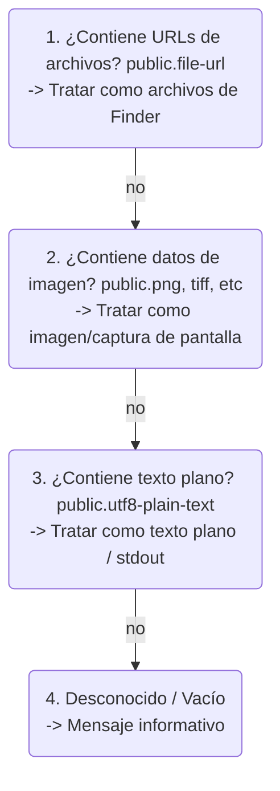

# Especificación Funcional: hot-clipboard (`hc` / `hp`)

Documento de diseño y especificación funcional para la herramienta de portapapeles bidireccional y de alta ergonomía para macOS.

---

## 1. Visión General

`hot-clipboard` es una herramienta CLI escrita en Rust que elimina la fricción entre la terminal y el portapapeles del sistema operativo macOS (`NSPasteboard`).

Proporciona dos binarios simétricos de dos letras:
* **`hc` (Hot Copy):** Carga datos, archivos o flujos al portapapeles.
* **`hp` (Hot Paste):** Vuelca, guarda o transforma el contenido del portapapeles en el disco o la terminal.

---

## 2. Especificación de `hc` (Hot Copy)

El binario `hc` se encarga de transferir información hacia el `NSPasteboard`.

### 2.1 Modos de Operación

#### A. Copia de Archivos para el Finder (Múltiples archivos y carpetas)
* **Comando:** `hc <ruta1> [ruta2 ...]` (Soporta globs de shell como `hc *.png` o `hc docs/* video.mp4`)
* **Comportamiento:**
  * Itera sobre todos los argumentos recibidos.
  * Resuelve cada ruta a su ruta absoluta canónica.
  * Valida que cada archivo o directorio exista en disco.
  * Registra la lista completa de `NSURL` en el `NSPasteboard` (`public.file-url` y `NSFilenamesPboardType`).
* **Resultado:** La lista completa de archivos queda en el portapapeles. Al hacer `⌘V` en Finder o aplicaciones, se pegan todos juntos exactamente como si hubieras seleccionado varios archivos y presionado `⌘C`.

#### B. Copia de Flujo de Texto (Modo Pipe / Stdin)
* **Comando:** `cat archivo.md | hc` o `git status | hc`
* **Detección:** Detecta automáticamente si `stdin` no es una terminal interactiva (`!stdin.is_terminal()`).
* **Comportamiento:**
  * Lee el flujo entrante de bytes UTF-8.
  * Escribe el tipo `public.utf8-plain-text`.
* **Resultado:** Texto listo para pegar en cualquier editor o campo de texto.
* **Nota:** Esta es la **única** forma de copiar texto con `hc`. Los argumentos posicionales siempre se interpretan como rutas de archivo.

#### C. Copia de Imagen como Mapa de Bits (`-b, --bitmap`)
* **Comando:** `hc -b foto.png` o `hc --bitmap imagen.jpg`
* **Comportamiento:**
  * Lee el archivo gráfico y extrae sus bytes de imagen como datos crudos (`public.png` / `public.tiff`).
* **Resultado:** Se pega como imagen incrustada (bitmap) en aplicaciones como Figma, Photoshop, Notion o Discord, sin necesidad de adjuntarlo como archivo. Comportamiento especializado; el modo por defecto (`hc foto.png`) copia como file URL.

### 2.2 Tabla de Comandos y Flags de `hc`

| Comando / Flag | Descripción | Ejemplo |
| :--- | :--- | :--- |
| `hc <archivos...>` | Copia archivos al portapapeles para Finder/Apps | `hc doc.pdf video.mp4` |
| `<comando> \| hc` | Copia el output del comando como texto plano | `cat schema.sql \| hc` |
| `hc -b, --bitmap <ruta>` | Copia una imagen como bitmap directo | `hc -b icon.png` |
| `hc -c, --clear` | Limpia todo el contenido del portapapeles | `hc -c` |
| `hc -h, --help` | Muestra la ayuda y opciones disponibles | `hc --help` |

---

## 3. Especificación de `hp` (Hot Paste)

El binario `hp` se encarga de extraer, renombrar, convertir o emitir el contenido del `NSPasteboard`.

### 3.1 Modos de Operación

#### A. Pegado con Nombre, Renombrado y Conversión (`hp <nombre_o_destino>`)

**Jerarquía de decisión cuando `hp` recibe un argumento posicional:**

1. **Si el argumento existe como directorio** → Pegar archivos dentro de ese directorio.
2. **Si el argumento NO existe** → Renombrar/guardar con ese nombre.
3. **Para forzar comportamiento específico:**
   * `hp -r, --rename <nombre>`: Forzar renombrado (incluso si el nombre coincide con un directorio existente).
   * `hp -d, --dir <ruta>`: Forzar destino como directorio (crear si no existe).

---

##### A.1. Renombrado de 1 archivo con inferencia de extensión

**Cuando hay 1 archivo en el portapapeles y el argumento NO existe como directorio:**

* **Si `<nombre>` incluye extensión explícita** → Usar esa extensión (convertir si es necesario).
  ```bash
  hc captura.png
  hp diagrama.jpg       # → diagrama.jpg (conversión PNG→JPEG)
  ```

* **Si `<nombre>` NO incluye extensión** → Heredar la extensión del archivo original.
  ```bash
  hc documento_largo.pdf
  hp reporte            # → reporte.pdf (hereda .pdf)
  
  hc captura.png
  hp foto               # → foto.png (hereda .png)
  
  hc /usr/local/bin/fd
  hp myfd               # → myfd (sin extensión, como el original)
  ```

* **Caso especial: imágenes crudas (capturas sin archivo original):**
  ```bash
  ⌘⇧⌃4  # Captura al portapapeles (formato TIFF de macOS)
  hp foto               # → foto.png (conversión automática a PNG)
  hp foto.jpg           # → foto.jpg (conversión a JPEG)
  ```

---

##### A.2. Conversión batch con patrón `*.extensión`

**Cuando el argumento es un patrón `*.ext` (empieza con `*.` seguido de extensión alfanumérica):**

* Mantiene el nombre base original de cada archivo.
* Cambia la extensión a la especificada.
* Realiza conversión de formato si es necesario (imágenes, texto).

**Ejemplos:**
```bash
# Conversión de formato de imágenes
hc foto1.png foto2.png screenshot.png
hp *.jpg              # → foto1.jpg, foto2.jpg, screenshot.jpg

# Cambio de extensión de documentos
hc draft.md notes.md
hp *.txt              # → draft.txt, notes.txt

# Con directorio destino
hc img1.png img2.png
hp -d converted *.jpg # → converted/img1.jpg, converted/img2.jpg
```

---

##### A.3. Múltiples archivos y directorios

**Cuando hay múltiples archivos en el portapapeles:**

* **Si el argumento existe como directorio** → Pegar todos dentro con nombres originales.
  ```bash
  hc img1.png img2.png
  hp fotos/             # fotos/ existe → pega fotos/img1.png, fotos/img2.png
  ```

* **Si el argumento NO existe** → Error claro indicando que hay múltiples archivos y se necesita especificar un directorio.
  ```bash
  hc img1.png img2.png
  hp archivo_unico      # Error: "Clipboard contains 2 files. Specify a directory: hp -d <dir>"
  ```

---

##### A.4. Texto e imágenes crudas

* **Texto plano:** Escribe el contenido en el archivo con el nombre/extensión indicados (sin validación de extensión).
  ```bash
  # Copias un token o snippet
  ⌘C en navegador
  hp config.env         # Crea config.env con el texto
  hp script.sh          # Crea script.sh con el contenido
  ```

* **Imagen cruda (captura de pantalla):**
  ```bash
  ⌘⇧⌃4  # Captura al portapapeles
  hp captura            # → captura.png (default a PNG si no hay extensión)
  hp captura.jpg        # → captura.jpg (conversión a JPEG)
  ```

#### B. Pegado Inteligente sin Argumentos (`hp`)
* **Comando:** `hp`
* **Comportamientos automáticos por prioridad:**
  1. **Si hay archivos de Finder (`public.file-url`):**
 mar   * Copia todos los archivos al directorio de trabajo actual (`./`) conservando sus nombres originales.
  2. **Si hay una imagen cruda (captura de pantalla):**
     * Genera un archivo con timestamp automático: `clip_YYYY-MM-DD_HHmmss.png`.
  3. **Si hay texto plano:**
 mar   * Si la salida es una terminal interactiva: imprime el texto en pantalla.
 mar   * Si la salida es una tubería/redirección (`hp > output.txt` o `hp | grep foo`): emite el flujo estándar limpio.
  4. **Si hay datos binarios desconocidos:**
     * Error: `"Clipboard contains binary data. Specify a filename: hp <name>"` (Código de salida `1`).

#### C. Inspección del Portapapeles (`-i, --info`)
* **Comando:** `hp --info` o `hp -i`
* **Comportamiento:**
  * Inspecciona los tipos UTI presentes en `NSPasteboard`.
  * Muestra:
    * Tipos disponibles (`public.file-url`, `public.png`, `public.utf8-plain-text`, etc.).
    * Cantidad de elementos y tamaño aproximado en bytes.
    * Origen o ruta si son archivos de Finder.

### 3.2 Tabla de Comandos y Flags de `hp`

| Comando / Flag | Descripción | Ejemplo |
| :--- | :--- | :--- |
| `hp` | Auto-pega según contenido (archivos → carpeta, imagen → `clip_<time>.png`, texto → stdout) | `hp` |
| `hp <nombre>` | Pega/convierte guardándolo con ese nombre (hereda extensión si no se especifica) | `hp captura` → `captura.png` |
| `hp *.ext` | Conversión batch: mantiene nombres originales, cambia extensión | `hp *.jpg` |
| `hp -r, --rename <nombre>` | Forzar renombrado (incluso si el nombre es un directorio existente) | `hp -r fotos` |
| `hp -d, --dir <ruta>` | Directorio destino (crear si no existe) | `hp -d ~/Downloads` |
| `hp -f, --force` | Sobrescribe archivos existentes sin preguntar | `hp -f captura.png` |
| `hp -i, --info` | Muestra los metadatos y tipos del portapapeles | `hp --info` |
| `hp -h, --help` | Muestra la ayuda y opciones disponibles | `hp --help` |

---

## 4. Jerarquía de Detección de Tipos (NSPasteboard)

Cuando `hp` inspecciona el portapapeles, evalúa los tipos en el siguiente orden de prioridad:

```
┌────────────────────────────────────────────────────────┐
│ 1. ¿Contiene URLs de archivos? (public.file-url)       │
│    -> Tratar como archivo(s) de Finder                 │
└──────────────────────────┬─────────────────────────────┘
                           │ No
┌──────────────────────────▼─────────────────────────────┐
│ 2. ¿Contiene datos de imagen? (public.png, tiff, etc)  │
│    -> Tratar como imagen/captura de pantalla           │
└──────────────────────────┬─────────────────────────────┘
                           │ No
┌──────────────────────────▼─────────────────────────────┐
│ 3. ¿Contiene texto plano? (public.utf8-plain-text)     │
│    -> Tratar como texto plano / stdout                 │
└──────────────────────────┬─────────────────────────────┘
                           │ No
┌──────────────────────────▼─────────────────────────────┐
│ 4. Desconocido / Vacío                                 │
|    -> Mensaje informativo                              │
└────────────────────────────────────────────────────────┘
```

---

## 5. Manejo de Errores y Casos Límite

**Nota:** Todos los mensajes de error, advertencias y output de la herramienta están en inglés.

1. **Portapapeles vacío:**
   * Mensaje en `stderr`: `Error: Clipboard is empty.` (Exit code `1`).
2. **Conflicto de archivos existentes:**
   * Si el archivo ya existe y no se pasó `--force`: `Error: File 'X' already exists. Use --force to overwrite.` (Exit code `1`).
3. **Archivo no existe (para `hc`):**
   * Si un argumento no existe en disco: `Error: No such file or directory: 'X'` (Exit code `1`).
4. **Múltiples archivos sin directorio destino:**
   * `Error: Clipboard contains N files. Specify a directory: hp -d <dir>` (Exit code `1`).
5. **Datos binarios desconocidos sin nombre:**
   * `Error: Clipboard contains binary data. Specify a filename: hp <name>` (Exit code `1`).
6. **Archivos de origen eliminados:**
   * Si el portapapeles tiene una URL de archivo que ya no existe: `Error: Source file no longer exists: 'path'` (Exit code `1`).

---

## 6. Arquitectura del Proyecto en Rust

* **Estructura del Crate:**


* **Dependencias Principales:**
  * `objc2`, `objc2-app-kit`, `objc2-foundation`: FFI segura y moderna con las APIs de macOS.
  * `clap`: Parseo de argumentos con subcomandos y flags de estilo moderno.
  * `image`: Procesamiento y codificación de imágenes (PNG/JPEG/WebP).
  * `colored` / `anstream`: Salida estilizada y limpia en consola.
  * `chrono`: Timestamps precisos para nombres de captura automáticos.
